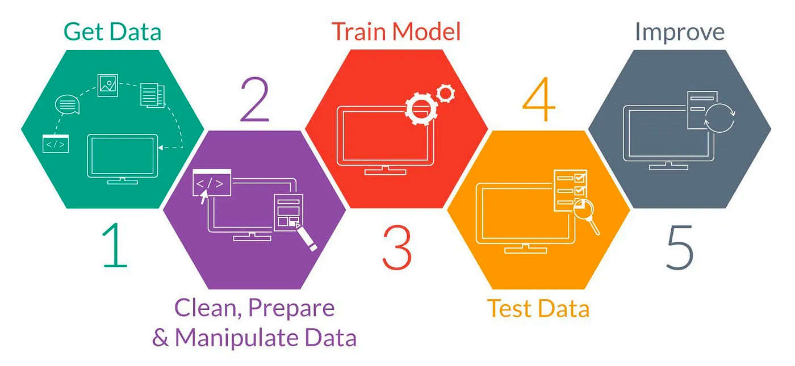

# Artificial Neural Networks Project

## Introduction


Welcome to the Artificial Neural Networks Project notebook! In this project, we will explore the fundamentals of neural networks,
implement practical examples using [Keras](https://www.tensorflow.org/guide/keras) 
library (from [TensorFlow](https://www.tensorflow.org/guide/basics))
, evaluate model performance, and compare different approaches.


```{attention}
I perceive this project as my first step into the realm of machine learning, 
particularly in supervised learning. However, it signifies not merely a starting point but rather an 
intersection of multidisciplinary skills cultivated throughout my academic journey.
 Its realization marks not only the beginning of a journey but also the culmination of a path that has integrated
  and fused comptence from various spheres of study.
```


Into this project, we will also learn the pipeline of a machine learning project, from data preparation to model evaluation.



Image credit: https://medium.com/analytics-vidhya/introduction-to-artificial-neural-networks-ann-5cf3b324204c


Let's get started!

